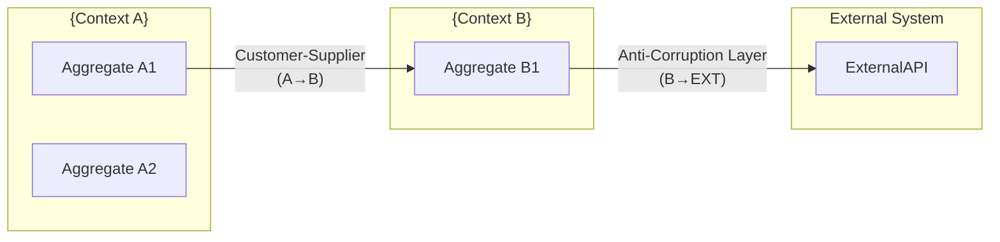

# sdd-event-storming — Event Storming ワークショップガイド

## 0. 目的

Alberto Brandolini考案のEvent Stormingで**ドメイン知識を素早く可視化**し、
Bounded Context・Ubiquitous Languageを確定する。

- 付箋の色体系（Domain Events/Commands/Aggregates/Policies）でドメインを整理する
- Bounded Context境界とContext Mapパターン（Partnership/Shared Kernel等）を特定する
- Aggregate のステートマシン（Mermaid stateDiagram）で状態遷移を可視化する
- 各Eventのスキーマ定義でコントラクトを明確化する
- `sdd-glossary` の上流インプット（Ubiquitous Language初期辞書）を生成する
- `sdd-design` へのアーキテクチャ境界の根拠を提供する

**世界標準**: Alberto Brandolini Event Storming, DDD Context Mapping, IBM EDA Architecture

## 1. 入力と出力（ファイル契約）

### 入力
- /sdd-event-storming $ARGUMENTS
  - $0 = spec-slug（例: google-ad-report）
  - $1 = target-dir（任意。未指定なら `.kiro/specs/<spec-slug>/` を使う）

### 入力ファイル（あれば読む）
- `<target-dir>/stakeholder-map.md`（sdd-stakeholder の出力）
- `<target-dir>/business-context.md`（sdd-context の出力）
- プロジェクト概要・要件メモ・API仕様

### 出力（必須）
- `<target-dir>/event-storming.md`

## 2. 重要ルール（絶対）

- **Domain Eventsは必ず過去形で記述**する（例: OrderPlaced, PaymentFailed）
- **Commandsは命令形**で記述する（例: PlaceOrder, ProcessPayment）
- **AggregatesはCommand + Event の自然なグループ**として特定する
- Bounded Contextの境界は「用語の意味が変わる場所」に引く
- Context Mapパターンは必ず選択して記載する（Partnership/Shared Kernel/Customer-Supplier/Anti-Corruption Layer/Open Host/Conformist）
- Ubiquitous Language辞書はドメインエキスパートが理解できる用語のみ記載する
- **各主要Aggregateのステートマシンを Mermaid stateDiagram で必ず可視化する**
- **主要Eventのスキーマ（フィールド定義）を必ず記載する**

## 3. 手順（アルゴリズム）

### Pre-Phase: 前提ファイル確認ゲート

実行前に以下を確認する:

1. `<target-dir>/business-context.md` の存在確認（Glob/Read）
2. `<target-dir>/stakeholder-map.md` の存在確認（Glob/Read）

**ファイルが存在しない場合**:
```
⚠️ 警告: ビジネスコンテキストが未作成です。

推奨順序:
  /sdd-stakeholder {spec-slug}       - ステークホルダー分析
  /sdd-context {spec-slug}           - ビジネス目標整合
  /sdd-event-storming {spec-slug}    - Event Storming（本スキル）

このまま続けますか？（ドメイン境界の根拠が薄くなります）
```

### Step A: ターゲットディレクトリ決定
- target-dir = $1 があればそれ、なければ `.kiro/specs/$0/`
- 無ければ作成する

### Step B: コンテキスト収集
既存ファイルを探索して読む（Glob/Grep/Read）:
```
- <target-dir>/stakeholder-map.md
- <target-dir>/business-context.md
- README.md, docs/
```

情報が不足している場合、以下の質問を提示してユーザーの回答を待つ:

#### ドメイン理解質問（情報不足時のみ）
1. このシステムで「最初に起きるイベント」は何ですか？（ユーザーの行動・外部トリガー）
2. このシステムで「最後に起きるイベント」は何ですか？（最終的な状態変化）
3. ビジネス上最も重要な「失敗イベント」は何ですか？
4. 「注文」「決済」「在庫」など、主要なビジネス概念を3〜5個挙げてください
5. 同じ言葉（例: 「顧客」）が文脈によって意味が変わる場合がありますか？
6. 外部システム（API・サービス）と連携する箇所はどこですか？
7. 人間が手動で判断・承認する箇所はどこですか？（Human in the Loop）
8. 定期的に自動実行される処理はありますか？（バッチ・スケジューラ）
9. 主要なエンティティ（Aggregate）はどの程度の「状態数」を持ちますか？（例: 注文: 未確定→確定→配送中→完了→キャンセル）
10. イベント発生後に「別のシステム」や「別のチーム」が反応する処理はありますか？（Downstream Consumer）

ユーザーが「仮置きで進めて」と言った場合は業界標準の仮定で埋め、「前提/仮定」に明記する。

### Step C: `event-storming.md` を生成

以下のテンプレートを完全に埋める:

```markdown
# Event Storming — {プロジェクト名}

> 生成日: {YYYY-MM-DD}
> スペック: {spec-slug}
> バージョン: 1.0
> 手法: Alberto Brandolini Event Storming (Big Picture + Design Level)

---

## 1. Big Picture Event Storming

### 付箋の色体系
| 色 | 種別 | 記述形式 |
|---|------|---------|
| 🟠 橙 | Domain Events | 過去形（〜した / 〜された） |
| 🔵 青 | Commands | 命令形（〜する / 〜せよ） |
| 🟡 黄 | Aggregates | 名詞（関連するCommand/Eventの境界） |
| 🟣 紫 | Policies/Reactors | 「〜したら〜する」のルール |
| 🟢 緑 | Read Models/Views | 意思決定に必要な情報 |
| 🔴 赤 | Hotspots/Problems | 未解決・議論が必要な箇所 |
| 💗 ピンク | External Systems | 外部API・外部サービス |
| 👤 人形 | Actors/Users | アクション実行者 |

---

## 2. Domain Events（橙 🟠）— 過去形で起きたこと

ビジネス上重要なすべての出来事。発生順にリストする。

### フロー: {メインフロー名}（例: 注文から決済）

```
[時系列 →]
{Event-001} → {Event-002} → {Event-003} → ...
```

| イベントID | Domain Event（過去形） | 英語名 | 発生トリガー | 影響を受けるエンティティ | 重要度 |
|-----------|---------------------|-------|------------|----------------------|-------|
| EVT-001 | {イベント名} | {EventName} | | | H/M/L |
| EVT-002 | | | | | |

### エラー・例外イベント

| イベントID | Domain Event（過去形） | 英語名 | 発生条件 | リカバリ方法 |
|-----------|---------------------|-------|---------|------------|
| EVT-E01 | {エラーイベント名} | {ErrorEventName} | | |

---

## 3. Commands（青 🔵）— Events を引き起こしたアクション

| コマンドID | Command（命令形） | 英語名 | 実行者（Actor） | 引き起こすEvent | 前提条件 |
|-----------|----------------|-------|--------------|--------------|---------|
| CMD-001 | {コマンド名} | {CommandName} | | EVT-xxx | |

---

## 4. Aggregates（黄 🟡）— 関連Command/Eventのグループ

Aggregateは「整合性の境界」。同一トランザクションで変更される概念をグループ化する。

| Aggregate名 | 英語名 | 責務 | 含まれるCommands | 含まれるEvents | 不変条件（Invariants） |
|-----------|-------|------|----------------|--------------|---------------------|
| {集約名} | {AggregateName} | | CMD-xxx, ... | EVT-xxx, ... | {例: 在庫数 >= 0} |

### {AggregateName} ステートマシン（Mermaid）

```mermaid
stateDiagram-v2
    [*] --> {初期状態}
    {初期状態} --> {状態A} : {CMD-xxx} / {EVT-xxx}
    {状態A} --> {状態B} : {CMD-xxx} / {EVT-xxx}
    {状態A} --> {エラー状態} : {CMD-xxx} / {EVT-Exx}
    {状態B} --> [*] : {CMD-xxx} / {EVT-xxx}
    {エラー状態} --> {状態A} : {CMD-xxx（リトライ）}
    note right of {状態A}
        Invariant: {不変条件の説明}
    end note
```

---

## 5. Policies / Reactors（紫 🟣）— 「〜したら〜する」のルール

| ポリシーID | ルール | トリガーEvent | 実行Command | 自動/手動 | タイムアウト |
|-----------|-------|-------------|-----------|---------|-----------|
| POL-001 | {Eventが起きたら}{Commandを実行する} | EVT-xxx | CMD-xxx | 自動/手動 | {N秒 / なし} |

---

## 6. External Systems（ピンク 💗）— 外部API・サービス

| システム名 | 種別 | 連携するEvent/Command | 連携方式 | オーナー | SLA/可用性 |
|-----------|-----|---------------------|---------|---------|----------|
| | API/DB/Batch | | REST/gRPC/Event | 社内/社外 | {稼働率%} |

---

## 7. Hotspots / Problems（赤 🔴）— 未解決・議論が必要

| ID | 問題・疑問 | 影響範囲 | 優先度 | 担当者 | 解決期限 |
|---|-----------|---------|-------|-------|---------|
| HOT-001 | | | H/M/L | | YYYY-MM-DD |

---

## 8. Bounded Context マップ

### コンテキスト一覧

| コンテキスト名 | 英語名 | 責務範囲 | 主要Aggregates | チーム | DB分離度 |
|-------------|-------|---------|--------------|-------|---------|
| {コンテキスト名} | {ContextName} | | | | 完全分離/スキーマ分離/共有 |

### Context Map（Mermaid）



### Context Map パターン解説

| アップストリーム | ダウンストリーム | パターン | 用語変換ルール | 実装方針 |
|--------------|--------------|---------|-------------|---------|
| {Context A} | {Context B} | Customer-Supplier / ACL / Open Host / Conformist | {用語A} → {用語B} | {DTO変換 / Translation Layer 等} |

---

## 9. Design Level Event Storming（主要フロー詳細）

Big Picture で特定した主要フローを、実装レベルまで掘り下げる。

### フロー: {最重要フロー名}

| ステップ | Actor | Command | Aggregate | Event | Read Model（参照情報） | Policy |
|---------|-------|---------|-----------|-------|---------------------|--------|
| 1 | {Actor} | CMD-001 | {Agg} | EVT-001 | {参照する情報} | — |
| 2 | System | CMD-002 | {Agg} | EVT-002 | — | POL-001 |

### 主要Eventスキーマ定義

```yaml
# EVT-001: {EventName}
event:
  name: {EventName}
  version: "1.0"
  aggregate: {AggregateName}
  fields:
    - name: {fieldName}
      type: string | number | boolean | datetime | uuid
      required: true
      description: "{説明}"
    - name: {fieldName}
      type: string
      required: false
      description: "{説明}"
  metadata:
    - eventId: uuid  # 重複排除用
    - occurredAt: datetime
    - aggregateId: uuid
    - causationId: uuid  # 引き起こしたCommandのID
    - correlationId: uuid  # トレーシング用
```

---

## 10. Ubiquitous Language 初期辞書

sdd-glossary への引き継ぎインプット。Event Stormingで確定した用語のみ記載。

| 用語（日本語） | 用語（英語/コード名） | Bounded Context | 定義（1文） | 使用コンテキスト | 誤用例 |
|-------------|---------------------|----------------|-----------|--------------|------|
| {用語} | {EnglishTerm} | {ContextName} | {定義} | | |

---

## 11. Event Flow 全体図（Mermaid）

```mermaid
sequenceDiagram
    participant Actor as {アクター名}
    participant {ContextA} as {Context A}
    participant {ContextB} as {Context B}
    participant Ext as External System

    Actor->>+{ContextA}: {Command}（CMD-001）
    {ContextA}-->>-Actor: {Event}（EVT-001）
    {ContextA}->>+{ContextB}: {Event via Integration}（EVT-001）
    {ContextB}-->>-{ContextA}: Ack（EVT-002）
    {ContextB}->>Ext: {Command}（CMD-002）
    Ext-->>ContextB}: {Event}（EVT-003）
```

---

## 12. 前提・仮定・未解決事項

### 前提（確定済み）
- {前提1}

### 仮定（未検証）
- {仮定1}（検証方法: {方法}）

### 未解決事項（Open Questions）
- [ ] {質問1}（判断期限: {日付}、担当: {役割}）

---

## 13. 次のステップ

1. `sdd-glossary` でUbiquitous Language辞書を完成させる（Section 10 を直接引き継ぎ）
2. `sdd-design` でBounded Contextを元にアーキテクチャを設計する（Section 8 を基盤に）
3. `sdd-req100` でAggregateごとのEARS要件を定義する
4. Hotspots（赤付箋: Section 7）の問題を解決してから実装に進む
5. `sdd-tasks` でEventごとにImplementationタスクを生成する
```

### Step D: 品質チェック（自己検証）

生成後に以下を確認する:
- [ ] Domain EventsはすべてEVT-xxxのIDを持ち、過去形か（〜した/〜された）
- [ ] CommandsはすべてCMD-xxxのIDを持ち、命令形か
- [ ] AggregateのInvariants（不変条件）が最低1つ記載されているか
- [ ] 主要AggregatのステートマシンがMermaid stateDiagramで可視化されているか
- [ ] 主要EventのスキーマYAMLが記載されているか
- [ ] Bounded Contextが最低1つ特定され、Context MapのMermaidが作成されているか
- [ ] Ubiquitous Language辞書にエントリが最低5件あるか
- [ ] Hotspots（赤付箋）が解決済みか確認したか（未解決なら明記）

## 4. 最終応答（チャットに返す内容）

- 特定したDomain Events数（主要フロー / エラー）
- 特定したBounded Context数とContext Mapパターン
- 特定したAggregate数とステートマシンの状態数
- Ubiquitous Language初期辞書のエントリ数
- Hotspots（未解決問題）リストと解決期限
- 生成ファイルパス

## 5. 実行例

```bash
/sdd-event-storming google-ad-report
```

出力:
```
.kiro/specs/google-ad-report/
└── event-storming.md   # Domain Events + Commands + Aggregates + ステートマシン + Context Map
```

## 6. 後続スキルへの引き継ぎ

- `sdd-glossary`: Section 10（Ubiquitous Language初期辞書）を直接引き継ぐ
- `sdd-design`: Section 8（Bounded Context Map）をアーキテクチャの基盤にする
- `sdd-req100`: Aggregate単位で要件を構造化する（Section 4のInvariantsが制約になる）
- `sdd-tasks`: EventごとにImplementationタスクを生成する（Section 9のDesign Level）
- `sdd-threat`: EventフローのSTRIDE分析（Section 11のシーケンス図を使用）
