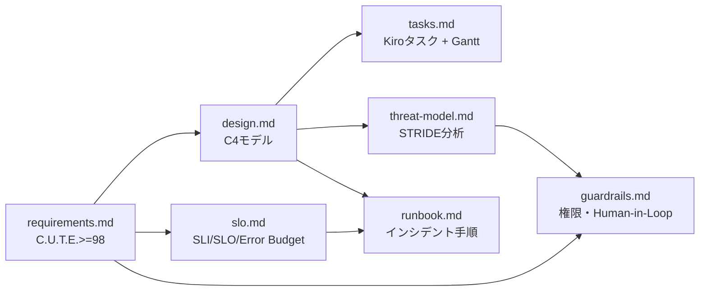

# sdd-full — Complete Spec-Driven Development Pipeline

## 0. 目的

**SDDの全成果物を一括生成し、実装可能な状態（L3）に到達させる**。

- 7つの成果物（要件定義 → 設計 → SLO → タスク → 脅威モデル → Runbook → ガードレール）を依存順に自動生成
- 各成果物間のクロスドキュメント整合性を検証し、矛盾を排除する
- C.U.T.E. スコア >= 98 を品質ゲートとして設定し、未達なら改善ループ
- 成熟度レベル（L1〜L5）を算出し、L3以上でのみ「実装可能」と宣言する

**前提**: 各個別スキル（sdd-req100 / sdd-design / sdd-slo 等）のロジックをインラインで実行する。
個別スキルを単体で実行した場合と同等品質の成果物を生成する。

## 1. 入力と出力（ファイル契約）

### 入力
- /sdd-full $ARGUMENTS
  - $0 = spec-slug（例: google-ad-report）
  - $1 = target-dir（任意。未指定なら `.kiro/specs/<spec-slug>/` を使う）

### 出力（すべて必須）

```
<target-dir>/
├── requirements.md      # EARS準拠要件定義 (C.U.T.E. >= 98)
├── design.md            # C4モデル設計書
├── slo.md               # SLO/SLI/SLA定義
├── tasks.md             # Kiro形式タスク分解（Ganttチャート付き）
├── threat-model.md      # STRIDE脅威モデル
├── runbook.md           # インシデント対応手順
├── guardrails.md        # AIガードレール（権限・Human-in-Loop）
├── critique.md          # 採点結果詳細
├── score.json           # 機械採点結果
└── adr/
    └── README.md        # ADR一覧（初期は空）
```

## 2. 成熟度レベル定義

| Level | 名称 | 達成条件 | 本スキルの目標 |
|-------|------|---------|---------------|
| L0 | None | ファイルなし | - |
| L1 | Draft | requirements.md 作成済み | - |
| L2 | Review Ready | C.U.T.E. >= 90、requirements + design 作成済み | - |
| **L3** | **Implementation Ready** | C.U.T.E. >= 98、7成果物完備、整合性エラー0 | ✅ **目標** |
| L4 | Production Ready | 実装完了、テスト完了、セキュリティレビュー済み | - |
| L5 | Enterprise Ready | SLO達成実績、監視設定済み、Runbook運用実績 | - |

**L3 達成条件（すべて必須）**:
1. C.U.T.E. スコア >= 98
2. 7成果物がすべて存在する
3. クロスドキュメント整合性エラーが 0 件
4. セキュリティ要件（REQ-SEC-xxx）が requirements.md に存在する
5. 未解決事項（Open Questions）が 0 件

## 3. 生成順序と依存関係



**実行順序**（依存関係に従い厳守）:
1. **requirements.md** （独立・最初に生成）
2. **design.md** （← requirements.md）
3. **slo.md** （← requirements.md）
4. **tasks.md** （← requirements.md, design.md）
5. **threat-model.md** （← requirements.md, design.md）
6. **runbook.md** （← design.md, slo.md）
7. **guardrails.md** （← requirements.md, threat-model.md）

## 4. 重要ルール（絶対）

- **依存順序を厳守**: 前の成果物を読み込んでから次を生成する
- **整合性チェック必須**: Step I でクロスドキュメント検証を行い、矛盾を修正する
- **差分更新**: 既存ファイルがある場合は読み込んでから差分更新する（上書きしない）
- **スコア < 98 の場合は改善ループ**: 最大5回まで requirements.md を改善する
- **L3 未達の場合は宣言しない**: 成熟度レベルを誇張しない

## 5. 手順（アルゴリズム）

### Pre-Phase: 初期化とコンテキスト収集

1. target-dir を決定（`$1` があればそれ、なければ `.kiro/specs/$0/`）
2. target-dir が存在しなければ作成
3. 既存ファイルの確認（Glob: `<target-dir>/*.md`, `<target-dir>/adr/`）
4. 既存ファイルがあれば読み込む（差分更新モード）
5. コードベースを探索（Glob/Grep）:
   - `src/` または `app/` 配下の主要ファイル
   - `package.json` / `pyproject.toml`（技術スタック確認）
   - `prisma/schema.prisma` または `*.sql`（DBスキーマ）
   - `README.md`（プロジェクト概要）

#### 初期情報収集質問（情報が不足している場合のみ）

以下の意地悪質問を最大10個提示してユーザーの回答を待つ:

1. このシステムの**最重要機能**を1文で説明してください
2. **誰が**使い、**何に困っているとき**に使いますか？
3. **成功の定義**を数字で言うと？（例: DAU 1000人、応答時間 < 200ms）
4. **絶対に起きてはいけないこと**は何ですか？（データ損失、サービス停止等）
5. **セキュリティ要件**は？（個人情報取扱 / 決済 / 医療 / 一般）
6. **非機能要件**は？（可用性 99.9% / 応答時間 / スループット）
7. **インフラ制約**は？（AWS/GCP/Azure / オンプレ / 予算上限）
8. **チーム規模と技術スタック**は？
9. **リリース期限**はいつですか？
10. **将来の拡張**として予定していることは？

ユーザーが「仮置きで進めて」と言った場合は業界標準の仮定で埋め、`requirements.md` の「Assumption Log」に明記する。

---

### Step A: requirements.md の生成（sdd-req100 相当）

**EARS準拠の要件定義を生成し、C.U.T.E. スコア >= 98 を達成する**

1. EARS パターンに準拠した要件文（REQ-xxx）を生成
   - 各要件に「受入テスト（GWT）」「例外・エラー処理」「トレーサビリティ」を付ける
   - 曖昧語（might / some / fast / easy 等）を使用しない
   - Non-Goals セクション（やらないこと）を明記する
   - Assumption Log（前提・仮定）を明記する
   - セキュリティ要件（REQ-SEC-xxx）を最低3件含める

2. `python3 .claude/skills/sdd-req100/scripts/score_spec.py` でスコア採点:
   ```bash
   python3 .claude/skills/sdd-req100/scripts/score_spec.py \
     "<target-dir>/requirements.md" \
     --out-json "<target-dir>/score.json" \
     --out-critique "<target-dir>/critique.md"
   ```

3. スコアが 98 未満の場合: critique.md の指摘を潰して再採点（最大5回）

4. 5回後も未達の場合: 追加情報が必要な項目を「Open Questions」に記録し、
   現時点の最高品質版で次フェーズへ進む（スコアを正直に記録する）

---

### Step B: design.md の生成（sdd-design 相当）

**requirements.md を入力として、C4モデル準拠の設計書を生成する**

1. requirements.md を読み込み、機能要件・非機能要件・制約を抽出
2. C4モデル（System Context → Container → Component）を生成
   - Mermaid の C4Context / C4Container / C4Component 構文を使用
3. API設計（OpenAPI形式のエンドポイント一覧）を生成
4. データモデル設計（ER図 Mermaid / 主要テーブル定義）を生成
5. セキュリティ設計（認証・認可・データ暗号化）を記述
6. requirements.md の REQ-xxx との対応関係を明記する

---

### Step C: slo.md の生成（sdd-slo 相当）

**requirements.md の非機能要件からSLI/SLOを導出する**

1. requirements.md を読み込み、可用性・パフォーマンス・信頼性要件を抽出
2. SLI（測定指標）を定義:
   - 可用性: `(成功リクエスト数 / 全リクエスト数) × 100`
   - レイテンシ: `P50 / P95 / P99 応答時間`
   - エラー率: `5xx エラー数 / 全リクエスト数`
3. SLO（目標値）を設定（例: 可用性 99.9%、P99レイテンシ 500ms以下）
4. Error Budget Policy を定義（バジェット消費 > 50% でアラート等）
5. アラート設定をPrometheus/Alertmanager形式で記述

---

### Step D: tasks.md の生成（sdd-tasks 相当）

**requirements.md + design.md を入力として、Kiro形式のタスク一覧を生成する**

1. requirements.md と design.md を読み込む
2. タスクを6フェーズに分解:
   - Phase 0: 準備（環境構築・DB・認証）
   - Phase 1: コア機能（最重要機能）
   - Phase 2: 拡張機能
   - Phase 3: 統合・外部サービス
   - Phase 4: 検証・テスト
   - Phase 5: 運用準備（監視・ドキュメント）
3. 各タスクに `Implements: REQ-xxx` のトレーサビリティを付ける
4. 依存関係グラフ（Mermaid `graph LR`）を生成
5. Ganttチャート（Mermaid `gantt`）を生成し、クリティカルパスを `:crit` で表示
6. REQ → TASK トレーサビリティマトリックスを作成

---

### Step E: threat-model.md の生成（sdd-threat 相当）

**design.md を入力として、STRIDE脅威分析を実施する**

1. design.md を読み込み、信頼境界・データフロー・外部依存を特定
2. STRIDE分析を実施（Spoofing / Tampering / Repudiation / Info Disclosure / DoS / Elevation）
3. 各脅威にリスクスコア（影響度 × 発生確率）を設定
4. 緩和策を `REQ-SEC-xxx` として requirements.md への追加候補として記録
5. DFD（データフロー図）を Mermaid で生成

---

### Step F: runbook.md の生成（sdd-runbook 相当）

**design.md + slo.md を入力として、インシデント対応手順書を生成する**

1. design.md と slo.md を読み込む
2. Severity定義（SEV1〜SEV4: 初動目標・解決目標・エスカレーション先）を設定
3. 主要シナリオの対応手順を生成:
   - 高レイテンシ / 高エラー率 / DB障害 / リソース枯渇 / 外部API障害 / セキュリティインシデント
4. ロールバック手順（アプリ / DB / 設定変更）を記述
5. ポストモーテムテンプレート（5-Whys / タイムライン / 改善アクション）を含める

---

### Step G: guardrails.md の生成（sdd-guardrails 相当）

**requirements.md + threat-model.md を入力として、AIガードレールを生成する**

1. requirements.md と threat-model.md を読み込む
2. 権限境界を定義（Read-Only / Write / Admin の分離）
3. Human-in-the-Loop ゲートを設計（承認が必要な操作の一覧）
4. 監査証跡要件を定義（誰が / 何を / いつ / 結果）
5. 操作制限（禁止操作リスト・レート制限）を設定

---

### Step H: adr/README.md の初期化

```markdown
# Architecture Decision Records（ADR）一覧

> スペック: {spec-slug}
> 最終更新: {YYYY-MM-DD}
> 注: 詳細なADRは `/sdd-adr` スキルで追加してください

## ADR一覧

| ID | タイトル | ステータス | 作成日 | 決定内容要約 |
|----|---------|-----------|--------|------------|
| （初期はADRなし） | - | - | - | - |

## ADRの追加方法

```bash
/sdd-adr "技術決定のタイトル" {spec-slug}
```
```

---

### Step I: クロスドキュメント整合性検証（CRITICAL）

全成果物の生成完了後、以下の整合性を検証する。矛盾があれば修正する。

#### 検証項目

| チェックID | 内容 | 対象ファイル |
|-----------|------|------------|
| CC-001 | requirements.md の全 REQ-xxx が tasks.md に `Implements: REQ-xxx` として紐付いているか | req → tasks |
| CC-002 | design.md のコンポーネント名が runbook.md のシナリオ・コマンドと一致しているか | design → runbook |
| CC-003 | slo.md のSLO閾値が runbook.md の「症状」定義と一致しているか | slo → runbook |
| CC-004 | threat-model.md の緩和策（REQ-SEC-xxx）が guardrails.md に反映されているか | threat → guardrails |
| CC-005 | requirements.md の非機能要件が slo.md のSLO値と矛盾していないか | req → slo |
| CC-006 | design.md のデータモデルが tasks.md のPhase 0（DB設計タスク）と整合しているか | design → tasks |
| CC-007 | セキュリティ要件（REQ-SEC-xxx）が requirements.md, design.md, guardrails.md のすべてに存在するか | req/design/guardrails |

#### 矛盾が見つかった場合の処理

1. 矛盾箇所を特定してユーザーに報告
2. **要件定義（requirements.md）を正とする**（下位ドキュメントを修正）
3. 修正後に再度整合性チェックを実行
4. 全チェックがパスするまで繰り返す（最大3回）

---

### Step J: 成熟度レベル算出

以下のルーブリックでL0〜L5を算出する:

```python
score = 0

# L1 条件
if exists("requirements.md"):
    score = 1

# L2 条件
if score >= 1 and cute_score >= 90 and exists("design.md"):
    score = 2

# L3 条件
if (score >= 2
    and cute_score >= 98
    and all_7_files_exist()
    and cross_check_errors == 0
    and has_security_requirements()
    and open_questions == 0):
    score = 3

# L4, L5 は実装完了後に判定
```

---

### Step K: 最終スコア算出

```bash
python3 .claude/skills/sdd-req100/scripts/score_spec.py \
  "<target-dir>/requirements.md" \
  --out-json "<target-dir>/score.json" \
  --out-critique "<target-dir>/critique.md"
```

## 6. 品質ゲート

| チェック項目 | 基準 | 必須 | 未達時 |
|-------------|------|------|--------|
| C.U.T.E. スコア | >= 98 / 105 | ✅ | 改善ループ（最大5回） |
| 全成果物存在 | 7ファイル + adr/README.md | ✅ | 不足分を生成 |
| クロスドキュメント整合 | CC-001〜CC-007 全パス | ✅ | 矛盾を修正して再検証 |
| セキュリティ要件 | REQ-SEC-xxx が最低3件 | ✅ | requirements.md に追加 |
| 未解決事項（Open Questions） | 0件が理想 | ❌（警告のみ） | Open Questions に記録 |
| 成熟度レベル | L3 以上 | ✅ | 未達条件を明示して報告 |

## 7. 最終応答（チャットに返す内容）

```markdown
## ✅ SDD Pipeline Complete

### 成熟度: L{N} ({名称})

### スコア: {score_total} / 105
- Correct（正確性）: {C} / 25
- Unambiguous（明確性）: {U} / 25
- Testable（テスト可能性）: {T} / 25
- Explicit（明示性）: {E} / 25
- Traceable（トレーサビリティ）: +{Tr} / 5
- Stakeholder-Aligned（整合性）: +{St} / 5

### 生成ファイル
- ✅ requirements.md（要件数: {N}件、セキュリティ要件: {N}件）
- ✅ design.md（コンポーネント数: {N}個）
- ✅ slo.md（SLI: {N}個、SLO: {N}個）
- ✅ tasks.md（タスク数: {N}件、フェーズ: 6）
- ✅ threat-model.md（脅威数: {N}件）
- ✅ runbook.md（シナリオ数: {N}個）
- ✅ guardrails.md（制限数: {N}件）
- ✅ adr/README.md

### クロスドキュメント整合性
- CC-001〜CC-007: 全パス ✅ / {N}件の矛盾を修正済み

### 次のステップ
1. 📋 レビュー: `requirements.md` をステークホルダーに共有
2. 🏛️ ADR作成: 主要な技術決定を `/sdd-adr "{タイトル}" {spec-slug}` で記録
3. 🚀 実装開始: `tasks.md` の Phase 0 から着手
4. 🔒 セキュリティ確認: `guardrails.md` の Human-in-Loop ゲートをレビュー
5. 📊 SLO監視設定: `slo.md` のアラート設定をインフラに適用
```

## 8. 実行例

```bash
/sdd-full google-ad-report
```

出力:
```
.kiro/specs/google-ad-report/
├── requirements.md      # C.U.T.E.: 101/105
├── design.md
├── slo.md
├── tasks.md             # 47タスク, 6フェーズ
├── threat-model.md      # 12脅威識別
├── runbook.md           # 6シナリオ
├── guardrails.md
├── critique.md
├── score.json
└── adr/
    └── README.md
```

## 9. 個別スキルとの使い分け

| ユースケース | 推奨コマンド |
|------------|------------|
| 全成果物を一括生成（新規プロジェクト） | `/sdd-full {slug}` |
| 要件定義だけ精密に作りたい | `/sdd-req100 {slug}` |
| 設計書だけ更新したい | `/sdd-design {slug}` |
| セキュリティ分析だけ実施 | `/sdd-threat {slug}` |
| 技術決定を記録したい | `/sdd-adr "{title}" {slug}` |
| Runbookだけ更新したい | `/sdd-runbook {slug}` |
| タスク分解だけやり直したい | `/sdd-tasks {slug}` |

## 10. 後続スキルへの引き継ぎ

- `/sdd-adr`: 主要な技術決定（DB選定・認証方式・インフラ選択等）をADRとして記録
- `/sdd-glossary`: Ubiquitous Language辞書を作成し、命名規則を統一する
- `/sdd-event-storming`: ドメインイベントの洗い出しで要件をさらに精緻化する
- 実装着手: `tasks.md` の Phase 0 タスクから `/develop-backend` 等のスキルで実装開始
