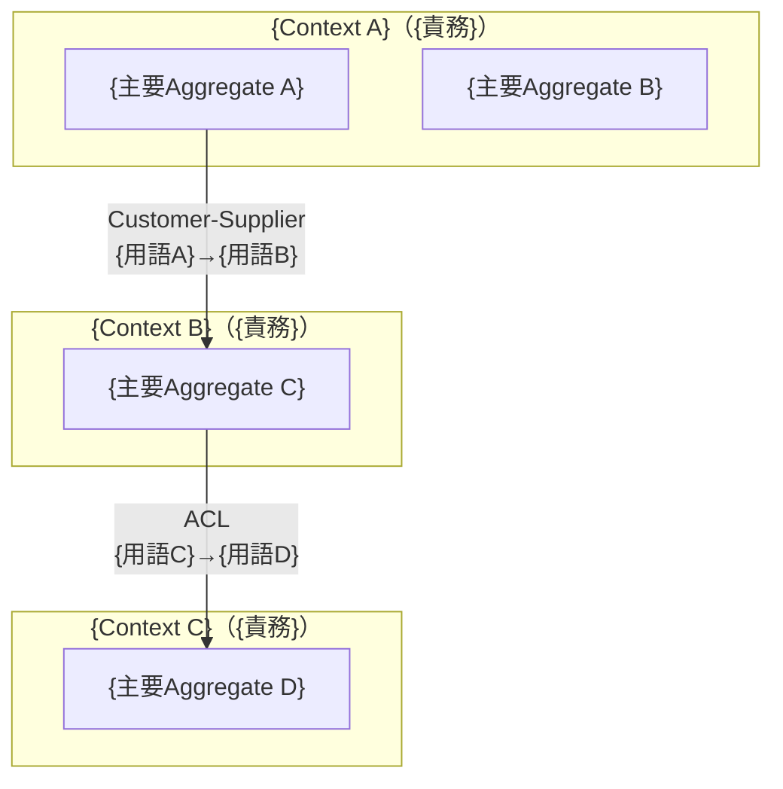
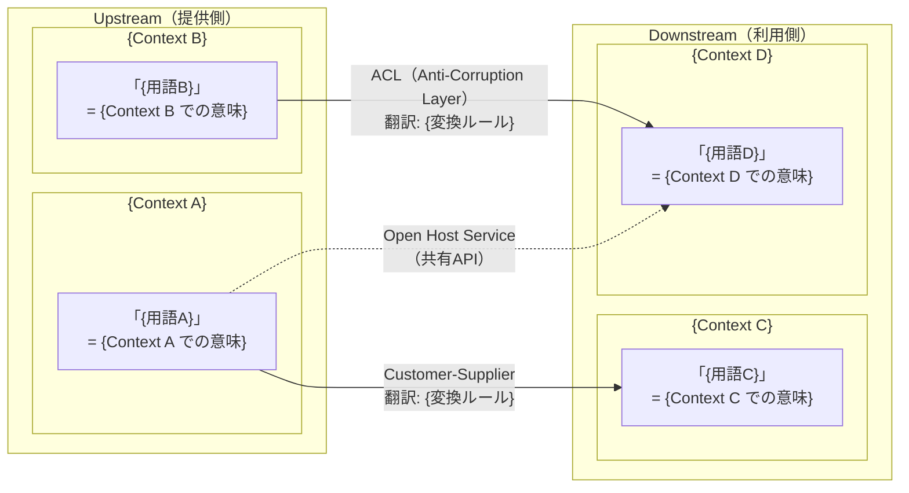

# sdd-glossary — Ubiquitous Language グロッサリー生成（DDD）

## 0. 目的

Eric Evans DDD の Ubiquitous Language 原則に従い、**プロジェクト全体で「一語一義」を保証する**辞書を生成する。

- ドメイン用語の文脈依存定義を確定し、コード・DB・ドキュメントの命名を統一する
- Bounded Context をまたぐ用語の「翻訳ルール」を明文化する（Anti-Corruption Layer の根拠）
- DBテーブル・カラム命名規則（snake_case/PascalCase 等）を標準化する
- `sdd-event-storming` の Ubiquitous Language 初期辞書を完成させる
- `sdd-design` のアーキテクチャ設計に用語の根拠を提供する
- Entity / Value Object / Aggregate Root の分類を明確化し、実装方針に一貫性を与える

**世界標準**: Eric Evans Domain-Driven Design, Arc42 §12 Glossary, Martin Fowler Context Mapping, Vaughn Vernon IDDD

## 1. 入力と出力（ファイル契約）

### 入力
- /sdd-glossary $ARGUMENTS
  - $0 = spec-slug（例: google-ad-report）
  - $1 = target-dir（任意。未指定なら `.kiro/specs/<spec-slug>/` を使う）

### 入力ファイル（あれば読む）
- `<target-dir>/requirements.md`（sdd-req100 の出力）
- `<target-dir>/event-storming.md`（sdd-event-storming の出力 — Section 9の初期辞書を優先）
- `<target-dir>/stakeholder-map.md`（sdd-stakeholder の出力）
- `<target-dir>/business-context.md`（sdd-context の出力）
- `<target-dir>/design.md`（sdd-design の出力。あれば）
- コードベース内の既存モデル定義・DBスキーマ・型定義（Glob で探索）

### 出力（必須）
- `<target-dir>/glossary.md`

## 2. 重要ルール（絶対）

- **各用語は Bounded Context ごとに定義する**（同じ言葉でも Context が違えば別エントリ）
- **コード名（英語）はキャメルケース/パスカルケースで記載し、DB名はスネークケースで記載する**
- **「誤用例」を必ず記載する**（何がアンチパターンかを明記）
- 用語の定義は「ドメインエキスパートが理解できる言葉」で1文以内にまとめる
- 同義語は「推奨用語」を1つ選び、他を「非推奨（→推奨用語を使う）」と明記する
- Context Map パターン（翻訳ルール）は必ずMermaid図で可視化する
- **DDD分類（Entity / Value Object / Aggregate Root / Domain Service）を全エントリに記載する**
- **イベント・コマンドの番号体系（EVT-xxx / CMD-xxx）を統一する**（sdd-event-storming との整合必須）

## 3. 手順（アルゴリズム）

### Pre-Phase: 入力確認ゲート

実行前に以下を確認する:

1. `<target-dir>/requirements.md` の存在確認（Glob/Read）
2. `<target-dir>/event-storming.md` の存在確認（Glob/Read）

**どちらも存在しない場合**:
```
⚠️ 警告: requirements.md と event-storming.md が見つかりません。

推奨順序:
  /sdd-req100 {spec-slug}          - 要件定義（先行推奨）
  /sdd-event-storming {spec-slug}  - ドメインイベント可視化（先行推奨）
  /sdd-glossary {spec-slug}        - Ubiquitous Language辞書（本スキル）

このまま続けますか？（既存コードベースから用語を抽出します）
```

**requirements.md のみ存在する場合**:
```
💡 ヒント: event-storming.md が未作成です。
  /sdd-event-storming {spec-slug} を先に実行すると、
  Section 9の初期辞書をインポートでき品質が向上します。
  このまま続けますか？
```

### Step A: ターゲットディレクトリ決定
- target-dir = $1 があればそれ、なければ `.kiro/specs/$0/`
- 無ければ作成する

### Step B: コンテキスト収集
既存ファイルを探索して読む（Glob/Grep/Read）:
```
優先順位:
1. <target-dir>/event-storming.md  （Section 9: Ubiquitous Language 初期辞書を優先）
2. <target-dir>/requirements.md    （REQ-xxx の用語を抽出）
3. <target-dir>/stakeholder-map.md （ステークホルダーが使う言葉を収集）
4. <target-dir>/business-context.md（ドメイン目標・競合用語）
5. <target-dir>/design.md          （アーキテクチャ用語）
6. src/ または app/ 配下の *.ts, *.py, *.go 等（既存コードの命名を調査）
7. prisma/schema.prisma, *.sql 等（DBスキーマの既存命名を調査）
```

情報が不足している場合、以下の質問を提示してユーザーの回答を待つ:

#### 用語確認質問（情報不足時のみ）
1. このドメインで「専門用語」として使われる言葉を5〜10個挙げてください
2. 「顧客」「ユーザー」「会員」など、似た言葉が複数存在しますか？使い分けは？
3. 同じ言葉（例: 「注文」）が部門・システムによって意味が異なる場合はありますか？
4. 英語表記の命名規則はありますか？（例: camelCase, snake_case, PascalCase）
5. DBのテーブル命名規則はありますか？（例: 複数形, 単数形, プレフィックス）
6. 外部システムや他チームと共有する用語で「意味の齟齬」が起きやすいものは？
7. このプロジェクト固有の略語・コードネームはありますか？
8. 各Bounded Contextの名前と責務範囲を教えてください（例: 注文Context / 在庫Context）
9. 同一エンティティを複数のコンテキストで扱う場合、どう変換しますか？（例: 注文→出荷依頼）
10. 将来的にContext Mapが変わる可能性（合併・分割）はありますか？

ユーザーが「仮置きで進めて」と言った場合は業界標準の仮定で埋め、「前提/仮定」に明記する。

### Step C: `glossary.md` を生成

以下のテンプレートを完全に埋める:

```markdown
# Ubiquitous Language グロッサリー — {プロジェクト名}

> 生成日: {YYYY-MM-DD}
> スペック: {spec-slug}
> バージョン: 1.0
> 手法: Eric Evans DDD, Arc42 §12 Glossary, Vaughn Vernon IDDD

---

## 1. エグゼクティブサマリー

このグロッサリーは **{プロジェクト名}** における「一語一義」を保証するための辞書である。
特定の Bounded Context 内でのみ有効な定義をコンテキスト付きで記載する。

**総用語数**: {N}件（Entity: {N}件 / Value Object: {N}件 / Aggregate Root: {N}件 / Domain Service: {N}件）

**Bounded Context 一覧**:



| Context名 | 責務 | 主要Aggregate |
|-----------|------|-------------|
| `{ContextA}` | {責務} | {Aggregate名} |
| `{ContextB}` | {責務} | {Aggregate名} |

---

## 2. 用語定義（メイン辞書）

### A〜Z / あ〜ん順に記載

| 用語（日本語） | 用語（英語/コード名） | DB名（snake_case） | DDD分類 | Bounded Context | 定義（1文） | 誤用例 | 関連用語 |
|-------------|---------------------|-----------------|--------|----------------|-----------|-------|---------|
| {用語} | {EnglishTerm} | {table_name / column_name} | Entity / VO / AR / DS | {ContextName} | {定義。ドメインエキスパートが理解できる1文} | {誤用例: 「〜と混同しやすい」など} | {関連用語ID} |

**DDD分類凡例**:
- **AR** = Aggregate Root（集約のエントリポイント。外部から直接参照する唯一のオブジェクト）
- **Entity** = 同一性（ID）で識別されるオブジェクト（値が変わっても同じもの）
- **VO** = Value Object（値の等価性で識別。不変・副作用なし）
- **DS** = Domain Service（どのEntityにも属さないドメインロジック）

---

## 3. 同義語・非推奨用語マップ

| 非推奨（使ってはいけない） | 推奨（使うべき） | 理由 | 影響範囲 |
|--------------------------|----------------|------|---------|
| {非推奨用語} | {推奨用語} | {なぜ非推奨か。混乱を招く・文脈が違う等} | コード / DB / ドキュメント / 全て |

---

## 4. Bounded Context 別用語定義

同じ用語が異なる Bounded Context で異なる意味を持つ場合、ここで明示する。

### {Context A} コンテキスト内での定義

**責務**: {このコンテキストが担う業務領域}

| 用語 | このコンテキストでの意味 | 型（AR/Entity/VO） | 他コンテキストとの違い |
|------|----------------------|----------------|---------------------|
| {用語} | {意味} | AR | {Context B では〜を意味する} |

### {Context B} コンテキスト内での定義

**責務**: {このコンテキストが担う業務領域}

| 用語 | このコンテキストでの意味 | 型（AR/Entity/VO） | 他コンテキストとの違い |
|------|----------------------|----------------|---------------------|
| {用語} | {意味} | Entity | |

---

## 5. Context Map 翻訳ルール（Mermaid）

Bounded Context をまたぐ際の用語変換ルールを図示する。

### Context Map 全体図



### Context Map パターン解説

| アップストリーム | ダウンストリーム | パターン | 用語変換ルール | 実装方法 |
|--------------|--------------|---------|-------------|---------|
| {Context A} | {Context B} | Anti-Corruption Layer | {用語A} → {用語B}: {変換ロジック} | {Translator クラス名等} |
| {Context A} | {Context C} | Customer-Supplier | {用語A} → {用語C}: {変換ロジック} | {API/イベント変換} |
| {Context B} | {Context C} | Open Host Service | {用語B} → {用語C}: {変換ロジック} | {公開API仕様} |

**Context Mapパターン一覧（参考）**:
| パターン | 関係 | いつ使うか |
|---------|------|-----------|
| Partnership | 双方向強依存 | 2チームが同期して変更する場合 |
| Shared Kernel | 共有コード | 両Contextが同じモデルを使う場合 |
| Customer-Supplier | 上流-下流（交渉可） | 下流が要件を上流に伝えられる場合 |
| Conformist | 上流-下流（従属） | 上流のモデルをそのまま使う場合 |
| Anti-Corruption Layer | 上流-下流（変換） | 外部システムや旧システムとの統合 |
| Open Host Service | 公開プロトコル | 多数の下流Contextが利用する場合 |

---

## 6. DB命名規則

### テーブル命名

| ルール | 例 | 説明 |
|-------|---|------|
| snake_case（必須） | `user_orders`, `payment_transactions` | 全テーブルで統一 |
| 単数形 / 複数形 | {例: `users`（複数形推奨）} | {プロジェクトの規約} |
| プレフィックス | {例: `m_` (マスタ), `t_` (トランザクション)} | {使う場合のみ} |
| Context境界 | {例: `ordering_orders`, `shipping_deliveries`} | Context名をプレフィックスにすることでスキーマ分離を明示 |

### カラム命名

| ルール | 例 | 説明 |
|-------|---|------|
| PK命名 | `id`（UUID推奨） / `{table_singular}_id` | 全テーブルで統一 |
| FK命名 | `{参照テーブル単数形}_id` | {例: `user_id`, `order_id`} |
| 日時カラム | `created_at`, `updated_at`, `deleted_at` | タイムゾーン: UTC（timestamptz）推奨 |
| フラグカラム | `is_{状態}` | {例: `is_active`, `is_deleted`} |
| enum列挙型 | `status VARCHAR` | 使用可能値をコメントまたはCHECK制約で明記 |
| 論理削除 | `deleted_at TIMESTAMPTZ NULL` | NULL = 有効、非NULL = 削除済み |

### 禁止パターン

| 禁止 | 理由 | 代替 |
|------|------|------|
| `flag1`, `flag2`, `data`, `info`, `tmp` | 意味が不明・メンテ不能 | `is_active`, `user_data`, `shipping_info` |
| 予約語: `order`, `user`, `group`, `select`, `where` | DBエンジンによっては予約語 | `orders`, `app_users`, `user_groups` |
| 略語の乱用: `usr`, `ord`, `pmt` | チームメンバーが読めない | `users`, `orders`, `payments` |
| camelCase: `userId`, `createdAt` | RDBMSではsnake_caseが標準 | `user_id`, `created_at` |
| 数字始まり: `1_users`, `2_orders` | SQL構文エラーの原因 | `users`, `orders` |
| Context名なし（複数Context共有スキーマの場合） | どのContextのテーブルか不明 | `ordering_orders`, `shipping_orders` |

---

## 7. イベント/コマンド命名規則

sdd-event-storming の Domain Events / Commands と番号体系を整合させる。

### Domain Events 命名規則（過去形）

| 番号体系 | パターン | 例 | 説明 |
|---------|---------|---|------|
| EVT-001〜 | {名詞 + 過去分詞} | `EVT-001: OrderPlaced` | ビジネス上重要な出来事 |
| EVT-002〜 | {名詞 + Past Tense} | `EVT-002: PaymentFailed` | エンティティの状態変化 |
| EVT-xxx | {Aggregate名 + 過去分詞} | `EVT-010: UserRegistered` | Aggregateに紐付けて命名 |

**禁止パターン**:
- `OrderCreate`（現在形 → `OrderPlaced` または `OrderCreated` に）
- `OrderEvent`（汎用すぎる → 具体的なイベント名に）
- `Changed`のみ（何が変わったか不明 → `OrderStatusChanged` など）

### Commands 命名規則（命令形）

| 番号体系 | パターン | 例 | 説明 |
|---------|---------|---|------|
| CMD-001〜 | {動詞 + 名詞} | `CMD-001: PlaceOrder` | アクターが実行するアクション |
| CMD-002〜 | {動詞 + 名詞} | `CMD-002: ProcessPayment` | システムが実行するアクション |
| CMD-xxx | {動詞 + Aggregate名} | `CMD-010: RegisterUser` | Aggregateに紐付けて命名 |

**禁止パターン**:
- `OrderCreation`（名詞形 → `CreateOrder` または `PlaceOrder` に）
- `DoOrder`（意味が弱い → `PlaceOrder` や `ConfirmOrder` など具体的に）

### EVT/CMD 番号割り当て表

| 番号範囲 | Bounded Context | 割り当てルール |
|---------|----------------|-------------|
| EVT-001〜049 | {Context A} | {Context Aのイベント} |
| EVT-050〜099 | {Context B} | {Context Bのイベント} |
| CMD-001〜049 | {Context A} | {Context AのCommand} |
| CMD-050〜099 | {Context B} | {Context BのCommand} |

---

## 8. 略語・コードネーム辞書

| 略語/コードネーム | 正式名称 | 説明 | 使用可能な場面 | 有効期限 |
|----------------|---------|------|-------------|---------|
| {略語} | {正式名称} | {説明} | コード内 / ドキュメント / 両方 | 永続 / {期日} |

---

## 9. DDD戦術パターン辞書

実装時の判断基準として、主要パターンの定義を記載する。

| パターン | 定義（1文） | 識別方法 | 実装上の注意 |
|---------|-----------|---------|-----------|
| **Aggregate Root** | 外部から直接参照できる唯一のエントリポイント | 他Contextから参照される・削除時に子を道連れにする | IDのみで参照。子Entityへの直接アクセス禁止 |
| **Entity** | 同一性（ID）で識別されるオブジェクト | ライフサイクルがある・状態が変化する | IDを持つ・`equals()`はIDで比較 |
| **Value Object** | 値の等価性で識別される不変オブジェクト | 交換可能・副作用なし・属性の組み合わせが意味を持つ | `new`で生成・setterなし・`equals()`は全フィールド比較 |
| **Domain Service** | どのEntity/VOにも自然に属さないドメインロジック | 複数のAggregateをまたぐ操作・ステートレス | 状態を持たない・インターフェース経由で呼び出す |
| **Repository** | Aggregateの永続化と取得を担う（コレクションのように見せる） | DBアクセスを隠蔽する | Aggregate Rootのみリポジトリを持つ |
| **Domain Event** | ドメインで重要な出来事（過去に起きたこと）を表すオブジェクト | ビジネス上意味のある状態変化 | 不変・命名は過去形・発行後は取り消し不可 |

---

## 10. 前提・仮定・未解決事項

### 前提（確定済み）
- {前提1}

### 仮定（未検証）
- {仮定1}（検証方法: {方法}）

### 未解決事項（Open Questions）
- [ ] {質問1}（判断期限: {YYYY-MM-DD}、判断者: {役割}）

---

## 11. 次のステップ

1. このグロッサリーを全チームメンバーに共有し、用語の認識合わせを行う
2. `sdd-design` でこのグロッサリーをアーキテクチャ設計に反映する
3. コードレビューで非推奨用語の使用を検出するLintルールを設定する（例: eslint-plugin-check-file）
4. 新機能追加時は必ずこのグロッサリーを更新してから実装を開始する
5. Bounded Context をまたぐAPI設計では Section 5（翻訳ルール）を参照する
6. EVT/CMD番号割り当て表を拡張しながらsdd-event-stormingと同期する
```

### Step D: 品質チェック（自己検証）

生成後に以下を確認する:
- [ ] 全用語に「定義（1文）」が記載されているか
- [ ] 全用語に「誤用例」が記載されているか
- [ ] 全用語に「DDD分類（AR/Entity/VO/DS）」が記載されているか
- [ ] 同義語マップに非推奨用語と推奨用語の対が揃っているか
- [ ] Context Map 全体図がMermaid図で可視化されているか（パターン名付き）
- [ ] DB命名規則の「禁止パターン」が6件以上記載されているか
- [ ] Domain Events が過去形（EVT-xxx番号付き）になっているか
- [ ] Commands が命令形（CMD-xxx番号付き）になっているか
- [ ] Ubiquitous Language 辞書のエントリが最低10件あるか
- [ ] DDD戦術パターン辞書（Section 9）が記載されているか

## 4. 最終応答（チャットに返す内容）

- 総用語数（DDD分類別: AR / Entity / VO / DS の内訳）
- Bounded Context 数とContext Mapのパターン種別（ACL / Customer-Supplier / Open Host 等）
- 同義語マップ（非推奨 → 推奨）の件数
- DB命名規則の主要禁止パターン
- EVT/CMD番号割り当てレンジ
- 生成ファイルパス

## 5. 実行例

```bash
/sdd-glossary google-ad-report
```

出力:
```
.kiro/specs/google-ad-report/
└── glossary.md   # Ubiquitous Language辞書 + Context Map(Mermaid) + DB命名規則 + DDD戦術パターン辞書
```

## 6. 後続スキルへの引き継ぎ

- `sdd-design`: glossary.md → アーキテクチャ・API設計の命名基盤・Aggregate境界の設計根拠
- `sdd-adr`: glossary.md → 命名規則変更・Context Map変更時のADRトリガー
- `sdd-tasks`: glossary.md → 実装タスクの命名ガイドライン・DDD分類に基づくクラス設計
- `sdd-req100`: glossary.md → 要件文の用語をUbiquitous Languageに統一・Non-Goals整合
- `sdd-threat`: glossary.md → Aggregate Root/VO の信頼境界設定・認可モデルのドメイン用語マッピング
- `sdd-event-storming`: glossary.md ↔ event-storming.md → EVT/CMD番号体系の双方向同期
