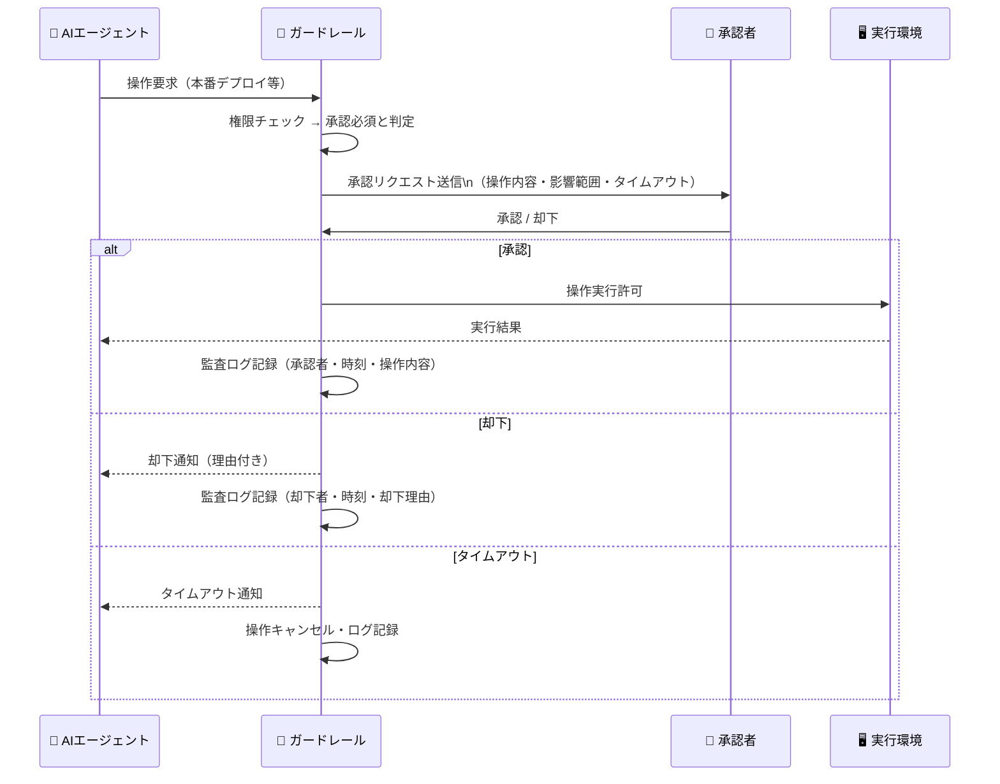
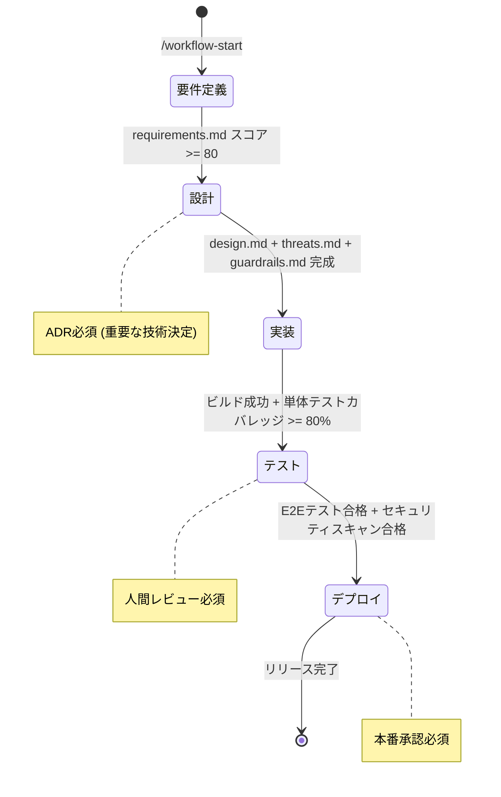

# sdd-guardrails — AIエージェントガードレール生成

## 0. 目的

**AIエージェントが安全に動作するための境界・承認ゲート・監査証跡を設計する**。

- 最小権限原則（Principle of Least Privilege）でデフォルト禁止・明示的許可を実現する
- Human-in-the-Loop ゲートで重要操作を人間が確実に承認する
- 全操作の監査証跡（Audit Trail）でトレーサビリティを保証する
- `sdd-threat` の緩和策（REQ-SEC-xxx）をガードレールとして実装する
- `sdd-slo` のエラーバジェット超過時の自動制限動作を定義する

**世界標準**: NIST AI RMF（AI Risk Management Framework）, OWASP LLM Top 10, Google AI Safety, Anthropic Constitutional AI

## 1. 入力と出力（ファイル契約）

### 入力
- /sdd-guardrails $ARGUMENTS
  - $0 = spec-slug（例: google-ad-report）
  - $1 = target-dir（任意。未指定なら `.kiro/specs/<spec-slug>/` を使う）

### 入力ファイル（必須）
- `<target-dir>/requirements.md`（REQ-SEC-xxx セキュリティ要件）
- `<target-dir>/threats.md`（STRIDE脅威と緩和策）

### 入力ファイル（あれば読む）
- `<target-dir>/design.md`（システム構成・API設計・権限モデル）
- `<target-dir>/slo.md`（エラーバジェット Policy）

### 出力（必須）
- `<target-dir>/guardrails.md`

## 2. 重要ルール（絶対）

- **デフォルト禁止（Default Deny）**: 明示的に許可されていない操作は全てブロックする
- **最小権限（Least Privilege）**: 各フェーズに必要な最小限の権限のみを付与する
- **Human-in-the-Loop必須**: 不可逆操作・本番操作・大規模変更は必ず人間承認を要求する
- **監査証跡（Audit Trail）**: 全操作をタイムスタンプ付きで記録する。消去・改ざん不可
- **フェーズ別権限管理**: 要件定義・設計・実装・テスト・デプロイ各フェーズで許可操作を制限する
- **エラーハンドリング**: 権限エラーは即時停止し、サイレントスキップ禁止

## 3. 手順（アルゴリズム）

### Pre-Phase: 入力確認ゲート

実行前に以下を確認する（Glob/Read）:

1. `<target-dir>/requirements.md` の存在確認
2. `<target-dir>/threats.md` の存在確認

**ファイルが存在しない場合**:
```
⚠️ 警告: threats.md が見つかりません。

推奨順序:
  /sdd-threat {spec-slug}       - 脅威モデリング（先に実行）
  /sdd-guardrails {spec-slug}   - ガードレール設計（本スキル）

threat.md なしで続けますか？（セキュリティ要件が不完全になります）
```

### Step B: コンテキスト収集

requirements.md / threats.md を読み込み、以下を抽出する:
1. セキュリティ要件（REQ-SEC-xxx）の一覧
2. STRIDE脅威の緩和策
3. システム構成（API・DB・外部連携）

情報が不足している場合、以下の質問を提示する:

#### ガードレール設計質問（情報不足時のみ）
1. AIエージェントが実行するプロジェクトの種別は？（Web開発/データ分析/インフラ管理/コンテンツ生成）
2. 本番環境への直接アクセス権限はありますか？
3. 外部APIへの書き込み権限はありますか？（DB書き込み/メール送信/課金処理等）
4. ファイル削除権限の範囲はどこまで許可しますか？
5. 最大同時実行タスク数の制限はありますか？
6. 1回のセッションで使用できる最大コスト（API費用）の上限はありますか？
7. 承認者（Human approver）は誰が担当しますか？
8. 監査ログの保存期間・保存場所は？
9. コンプライアンス要件（SOC2/ISO27001/GDPR等）はありますか？
10. SLOエラーバジェット超過時に実行制限を自動発動させますか？

ユーザーが「仮置きで進めて」と言った場合は業界標準の仮定で埋め、「前提/仮定」に明記する。

### Step C: `guardrails.md` を生成

以下のテンプレートを完全に埋める:

```markdown
# AIエージェントガードレール — {プロジェクト名}

> 生成日: {YYYY-MM-DD}
> スペック: {spec-slug}
> バージョン: 1.0
> 準拠フレームワーク: NIST AI RMF, OWASP LLM Top 10

---

## 1. ガードレール設計原則

| 原則 | 内容 | 適用範囲 |
|------|------|---------|
| Default Deny | 未定義の操作は全てブロック | 全操作 |
| Least Privilege | 各フェーズに最小権限のみ付与 | ファイル・コマンド・API |
| Human-in-the-Loop | 不可逆・本番・大規模操作は人間承認必須 | 承認ゲート一覧参照 |
| Audit Trail | 全操作をタイムスタンプ付き記録（改ざん不可） | 全ツール呼び出し |
| Fail-Safe Defaults | エラー時はデフォルト安全状態に戻す | 例外処理全般 |
| Defense in Depth | 多層防御（ファイル/コマンド/API/監査） | 全カテゴリ |

---

## 2. Permission Boundaries（権限境界）

### 2.1 ファイルシステム権限

| パス/パターン | Read | Write | Delete | Rename | 理由 |
|-------------|------|-------|--------|--------|------|
| `.kiro/specs/` | ✅ | ✅ | ❌ | ❌ | 仕様書は更新可・削除不可 |
| `src/`, `app/` | ✅ | ✅ | ✅ | ✅ | ソースコード（フルアクセス） |
| `tests/`, `test/` | ✅ | ✅ | ✅ | ✅ | テストコード |
| `docs/` | ✅ | ✅ | ✅ | ✅ | ドキュメント |
| `*.md` (root) | ✅ | ✅ | ❌ | ❌ | README等は更新可 |
| `.env`, `.env.*` | ❌ | ❌ | ❌ | ❌ | 機密情報（完全禁止） |
| `*.key`, `*.pem`, `*.p12` | ❌ | ❌ | ❌ | ❌ | 秘密鍵（完全禁止） |
| `node_modules/` | ❌ | ❌ | ❌ | ❌ | 不要な読み込み禁止 |
| `.git/` | ✅（Read限定） | ❌ | ❌ | ❌ | Gitコマンド経由のみ |
| `{本番設定ファイル}` | ❌ | ❌ | ❌ | ❌ | 本番設定は直接操作禁止 |

**禁止パターン（パス正規表現）**:
```
^\.env($|\.)           # .env系ファイル
\.(key|pem|p12|pfx)$  # 秘密鍵
/node_modules/         # 依存関係
\.git/objects/         # Gitオブジェクト
```

---

### 2.2 コマンド実行権限

#### 🟢 自動許可（Allowed without approval）

| カテゴリ | 許可コマンド | 条件 |
|---------|------------|------|
| ビルド | `npm run build`, `yarn build`, `bun build` | ローカル環境のみ |
| テスト | `npm test`, `pytest`, `go test ./...` | ローカル環境のみ |
| Lint/Format | `eslint`, `prettier`, `black`, `gofmt` | ファイルスコープ内 |
| Git（読み取り） | `git status`, `git log`, `git diff` | 全環境 |
| Git（ローカル書き込み） | `git add`, `git commit`, `git stash` | ローカルのみ |
| パッケージ確認 | `npm list`, `pip list` | 読み取りのみ |

#### 🟡 条件付き許可（Conditional approval required）

| カテゴリ | 操作 | 承認条件 |
|---------|------|---------|
| Git Push | `git push` | 初回またはforceプッシュ前に確認 |
| パッケージ追加 | `npm install {pkg}` | 新規パッケージ追加時 |
| DB Migration | `migrate up` | 本番適用前に確認 |
| ファイル削除 | `rm`, `Delete` | 5ファイル以上または`src/`外 |
| 外部API呼び出し | 書き込み系POST/PUT/DELETE | 初回エンドポイントのみ |

#### 🔴 Human承認必須（Human-in-the-Loop gate required）

| カテゴリ | 操作 | 承認者 | タイムアウト |
|---------|------|--------|-----------|
| 本番デプロイ | `kubectl apply`, `terraform apply` | プロジェクトオーナー | 30分 |
| 本番DB書き込み | 本番DB への INSERT/UPDATE/DELETE | DB管理者 | 15分 |
| 秘密情報アクセス | AWS Secrets Manager, HashiCorp Vault | セキュリティ責任者 | 10分 |
| 大規模削除 | 100ファイル以上の削除 | プロジェクトオーナー | 60分 |
| ブランチ強制プッシュ | `git push --force` | チームリード | 15分 |
| 課金処理 | Stripe/PayPal 本番決済 | ビジネスオーナー | 30分 |

#### ⛔ 完全禁止（Always Blocked）

| 操作 | 理由 |
|------|------|
| `rm -rf /`, `rm -rf ~` | システム破壊 |
| `mkfs`, `dd if=/dev/` | ディスク破壊 |
| `fork bomb` | リソース枯渇 |
| `sudo su`, `sudo -i` | 特権昇格 |
| `git push --force origin main/master` | 本番履歴消去 |
| `DROP DATABASE`, `TRUNCATE TABLE` (本番) | データ全消去 |
| 環境変数への秘密情報書き込み | 秘密情報漏洩 |
| `curl {URL} | bash` | 任意コード実行 |

---

### 2.3 API・外部サービス権限

| サービス | 読み取り | 書き込み | 削除 | 備考 |
|---------|---------|---------|------|------|
| {外部API名} | ✅ | 条件付き | ❌ | {条件の詳細} |
| GitHub API | ✅ | ✅（Issue/PR） | ❌ | Branch削除は禁止 |
| DB（ローカル/開発） | ✅ | ✅ | 条件付き | TRUNCATE禁止 |
| DB（ステージング） | ✅ | ✅ | 人間承認必須 | |
| DB（本番） | ❌ | 人間承認必須 | 禁止 | |

---

## 3. Resource Limits（リソース制限）

### 3.1 実行制限

| リソース | 制限値 | 超過時動作 | 通知要否 |
|---------|--------|----------|---------|
| 最大実行時間/タスク | 15分 | タスク強制終了・エラー報告 | 必須 |
| 最大ファイル読み込み数/セッション | 500ファイル | 警告→確認要求 | 推奨 |
| 最大ファイルサイズ（単一） | 10MB | スキップ・代替方法提案 | 任意 |
| 最大API呼び出し回数/タスク | 200回 | 警告→50回ごとに確認 | 推奨 |
| 最大同時実行エージェント数 | 5並列 | キューイング | 任意 |

### 3.2 コスト制限

| 制限種別 | 上限 | 超過時動作 |
|---------|------|----------|
| 1タスクあたりの推定LLMコスト | $0.50 | 確認要求・承認後継続 |
| 1日あたりの総コスト | $50 | 警告メール・翌日分は手動承認 |
| 1ヶ月あたりの総コスト | $500 | 自動停止・請求アラート |

---

## 4. Human-in-the-Loop ゲート設計

### 4.1 承認フロー



### 4.2 承認リクエストフォーマット

```
━━━━━━━━━━━━━━━━━━━━━━━━━━━━━━━━━━
🚦 APPROVAL REQUIRED — {操作種別}
━━━━━━━━━━━━━━━━━━━━━━━━━━━━━━━━━━
📋 操作内容: {具体的な操作の説明}
🎯 影響範囲: {影響を受けるシステム/データ}
⚠️  リスク:   {この操作の潜在的なリスク}
🔄 可逆性:   {可逆 / 不可逆（ロールバック方法: {方法}）}
⏱️  タイムアウト: {N}分後に自動キャンセル

✅ 承認する場合: [YES]
❌ 却下する場合: [NO + 理由]
━━━━━━━━━━━━━━━━━━━━━━━━━━━━━━━━━━
```

---

## 5. Audit Trail（監査証跡）

### 5.1 ログ必須項目

```json
{
  "event_id": "uuid-v4",
  "timestamp": "2026-01-01T00:00:00.000Z",
  "session_id": "session-{uuid}",
  "agent_id": "agent-{id}",
  "tool_name": "{Read|Write|Edit|Bash|..}",
  "action": "{操作の種別}",
  "target": "{操作対象: ファイルパス/APIエンドポイント/コマンド}",
  "status": "allowed|denied|pending_approval|approved|rejected|timeout",
  "approval": {
    "required": true,
    "approver": "{承認者ID}",
    "approved_at": "ISO8601",
    "reason": "{承認/却下理由}"
  },
  "result": "success|failure|skipped",
  "error": "{エラーメッセージ（失敗時のみ）}",
  "metadata": {
    "phase": "requirements|design|implementation|testing|deployment",
    "spec_slug": "{spec-slug}",
    "risk_level": "critical|high|medium|low"
  }
}
```

### 5.2 ログ保存・管理

| 項目 | 設定 |
|------|------|
| 保存先 | `.claude/audit/YYYY-MM-DD.jsonl`（1日1ファイル） |
| 保存期間 | 90日（コンプライアンス要件に応じて延長） |
| 改ざん防止 | 各ログエントリにHMAC署名を付与 |
| アクセス制御 | Append-onlyモード（上書き・削除禁止） |
| アラート | Critical操作・承認タイムアウト・権限エラーを即時通知 |

### 5.3 セッションサマリー自動生成

セッション終了時に以下のサマリーを生成する:

```markdown
## セッションサマリー — {YYYY-MM-DD HH:MM}

| 項目 | 値 |
|------|---|
| セッションID | {session-id} |
| 実行時間 | {N}分 |
| 総操作数 | {N} |
| 自動許可 | {N} |
| 承認要求 | {N}（承認: {N} / 却下: {N} / タイムアウト: {N}） |
| ブロック | {N} |
| エラー | {N} |

### 主要な操作ログ（上位10件）
| 時刻 | 操作 | 対象 | ステータス |
|------|------|------|-----------|
```

---

## 6. Error Handling（エラー処理）

| エラー種別 | 動作 | 通知 | ログ |
|-----------|------|------|------|
| 権限エラー（許可されていない操作） | 即時停止・エラー報告 | 必須 | 必須 |
| 承認タイムアウト | 操作キャンセル・次の代替案提案 | 任意 | 必須 |
| リソース制限超過 | 即時停止・使用量報告 | 必須 | 必須 |
| 外部API障害 | 指数バックオフリトライ（最大3回） | 任意 | 必須 |
| ファイル書き込みエラー | エラー報告・代替パス提案 | 任意 | 必須 |
| 不正な入力パラメータ | 入力検証エラー・修正提案 | 任意 | 推奨 |

**エラー時のデフォルト動作**:
```
1. 操作を即時停止（Fail-Safe Default）
2. エラー内容をAudit Logに記録（必須）
3. ユーザーにエラーと推奨アクションを報告
4. セッションは継続（操作のみキャンセル）
5. サイレントスキップ禁止（必ず報告する）
```

---

## 7. Workflow Rules（フェーズ別権限）

### 7.1 フェーズ別許可マトリックス

| フェーズ | 許可スキル | ブロックスキル | DB操作 | デプロイ操作 |
|---------|-----------|--------------|--------|------------|
| 要件定義 | sdd-req100, sdd-stakeholder, sdd-context, research | 実装系, デプロイ系 | Read Only | ❌ |
| 設計 | sdd-design, sdd-threat, sdd-adr, sdd-glossary, sdd-slo | デプロイ系 | Read Only | ❌ |
| 実装 | develop-*, generate-*, build-*, fix-* | デプロイ系（本番） | 開発DB ✅ / 本番DB ❌ | ステージング ✅ |
| テスト | test-*, validate-*, verify | デプロイ系（本番） | テストDB ✅ | ステージング ✅ |
| デプロイ | deploy, manage-releases | 要件系, 設計系 | 本番DB（承認後） | 本番（承認後） ✅ |

### 7.2 フェーズ遷移ゲート



---

## 8. セキュリティ要件との対応マッピング

threats.md で導出したセキュリティ要件（REQ-SEC-xxx）とガードレールの対応:

| REQ-SEC番号 | 要件内容（概要） | 対応するガードレールセクション |
|-----------|--------------|--------------------------|
| REQ-SEC-001 | {例: JWT検証} | Section 2.3（API権限）+ Section 4（承認ゲート） |
| REQ-SEC-002 | {例: 監査ログ} | Section 5（Audit Trail） |
| REQ-SEC-003 | {例: 最小権限} | Section 2.1（ファイル権限）+ Section 2.2（コマンド権限） |

---

## 9. SLOエラーバジェット連携

slo.md のエラーバジェット消費率に応じた自動制限:

| エラーバジェット消費率 | エージェント動作制限 |
|-------------------|-------------------|
| 0-50%（通常） | 制限なし（Section 2の標準権限） |
| 50-75%（注意） | 新規外部API呼び出しに確認要求追加 |
| 75-100%（警告） | 全ての書き込み操作に承認要求追加 |
| 100%+（超過） | 読み取り専用モード（Write/Delete/API書き込み禁止） |

---

## 10. 前提・仮定・未解決事項

### 前提（確定済み）
- {前提1}

### 仮定（未検証）
- {仮定1}（検証方法: {方法}）

### 未解決事項（Open Questions）
- [ ] {質問1}（判断期限: {日付}）

---

## 11. 次のステップ

1. `sdd-tasks` でガードレールの実装タスクを生成する
2. `sdd-runbook` でエラー時の対応手順（承認フロー・エスカレーション）を文書化する
3. `sdd-adr` で主要なガードレール設計決定を記録する
4. 実装後は定期的にガードレールの有効性をレビューする（四半期ごと推奨）
```

### Step D: 品質チェック（自己検証）

生成後に以下を確認する:
- [ ] 「完全禁止」リストに `rm -rf /`・`git push --force origin main` が含まれているか
- [ ] Human-in-the-Loop ゲートに本番デプロイ・本番DB書き込みが含まれているか
- [ ] 監査ログに event_id・timestamp・status が必須フィールドとして含まれているか
- [ ] フェーズ別権限マトリックスが全フェーズ（5段階）分記載されているか
- [ ] SLOエラーバジェット連携の4段階が記載されているか
- [ ] REQ-SEC-xxx との対応マッピングが記載されているか
- [ ] エラー処理の「サイレントスキップ禁止」が明記されているか

## 5. 最終応答（チャットに返す内容）

- ガードレールカテゴリ数（権限境界/承認ゲート/Audit Trail/エラー処理/ワークフロー）
- Human-in-the-Loop ゲート数（自動許可/条件付き/完全禁止の内訳）
- 対応セキュリティ要件数（REQ-SEC-xxx）
- 生成ファイルパス

## 6. 実行例

```bash
/sdd-guardrails google-ad-report
```

前提:
- `.kiro/specs/google-ad-report/requirements.md`
- `.kiro/specs/google-ad-report/threats.md`

出力:
- `.kiro/specs/google-ad-report/guardrails.md`

## 7. 後続スキルへの引き継ぎ

- `sdd-tasks`: guardrails.md → ガードレール実装タスクの生成
- `sdd-runbook`: Section 4（承認フロー）+ Section 6（エラー処理）→ 運用手順書
- `sdd-adr`: ガードレール設計の主要決定（承認フロー選択・ログ設計等）をADRに記録
- `sdd-slo`: Section 9（エラーバジェット連携）→ SLO Error Budget Policy との整合
