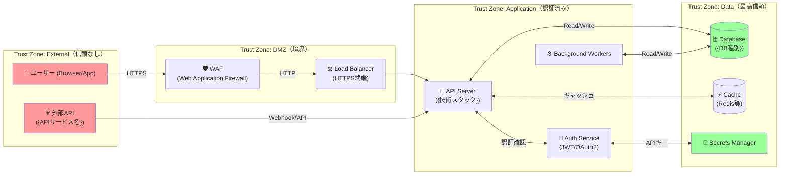

# sdd-threat — STRIDE脅威モデリング生成（設計段階セキュリティ分析）

## 0. 目的

**設計段階でセキュリティリスクを体系的に特定し、緩和策を要件として確定する**。

- STRIDE 6カテゴリで脅威を網羅的に洗い出す
- リスクスコアリング（影響度 × 発生可能性）で優先順位を明確化する
- 各緩和策を `REQ-SEC-xxx`（EARS準拠）として要件化する
- Data Flow Diagram（DFD）で信頼境界を可視化する
- `sdd-guardrails` への入力（セキュリティ要件・緩和策）を生成する

**世界標準**: Microsoft STRIDE, OWASP Threat Modeling, NIST SP 800-154, Adam Shostack "Threat Modeling"

## 1. 入力と出力（ファイル契約）

### 入力
- /sdd-threat $ARGUMENTS
  - $0 = spec-slug（例: google-ad-report）
  - $1 = target-dir（任意。未指定なら `.kiro/specs/<spec-slug>/` を使う）

### 入力ファイル（必須）
- `<target-dir>/requirements.md`（REQ-xxx および Non-Goals）
- `<target-dir>/design.md`（C4図・API設計・ER図・外部インターフェース）

### 出力（必須）
- `<target-dir>/threats.md`

## 2. 重要ルール（絶対）

- **STRIDE 6カテゴリ全て分析する**（1つでも省略禁止）
- **リスクスコアを数値で算出する**（影響度 1-5 × 発生可能性 1-5 = リスクスコア 1-25）
- **全 Critical/High 脅威に緩和策を必ず記述する**（Medium以下は省略可だが推奨）
- **緩和策は EARS準拠の `REQ-SEC-xxx` として要件化する**
- **信頼境界（Trust Boundary）をMermaid図で可視化する**
- DFDの「プロセス」「データストア」「外部エンティティ」「データフロー」を全て特定する

## 3. STRIDEカテゴリ定義

| カテゴリ | 日本語 | セキュリティ属性 | 典型的な脅威例 |
|---------|--------|----------------|--------------|
| **S**poofing | なりすまし | 認証（Authentication） | 認証情報盗取・セッションハイジャック・フィッシング |
| **T**ampering | 改ざん | 完全性（Integrity） | SQLインジェクション・パラメータ改ざん・MitM攻撃 |
| **R**epudiation | 否認 | 否認防止（Non-repudiation） | 操作ログ消去・証跡不備・タイムスタンプ改ざん |
| **I**nformation Disclosure | 情報漏洩 | 機密性（Confidentiality） | PII漏洩・エラーメッセージ漏洩・不正アクセス |
| **D**enial of Service | サービス拒否 | 可用性（Availability） | DDoS・リソース枯渇・スロースローリス攻撃 |
| **E**levation of Privilege | 権限昇格 | 認可（Authorization） | IDOR・ロールバイパス・特権昇格 |

## 4. 手順（アルゴリズム）

### Pre-Phase: 入力確認ゲート

実行前に以下を確認する（Glob/Read）:

1. `<target-dir>/requirements.md` の存在確認
2. `<target-dir>/design.md` の存在確認

**ファイルが存在しない場合**:
```
⚠️ 警告: requirements.md または design.md が見つかりません。

推奨順序:
  /sdd-req100 {spec-slug}   - 要件定義（先に実行）
  /sdd-design {spec-slug}   - アーキテクチャ設計（先に実行）
  /sdd-threat {spec-slug}   - 脅威モデリング（本スキル）

design.md なしで続けますか？（システム構成が不明なため分析品質が下がります）
```

### Step B: 資産と構成の特定

design.md / requirements.md を読み込み、以下を抽出する:

1. **保護対象資産（Assets）**
   - データ資産（認証情報・PII・ビジネスデータ・APIキー等）
   - 機能資産（重要な処理・決済・認証フロー等）
   - インフラ資産（サーバー・DB・ネットワーク等）
   - 各資産の重要度を `Critical / High / Medium / Low` で分類

2. **外部インターフェース**
   - 外部API・Webhook・ユーザー入力ポイント
   - 認証境界（認証が必要な/不要な境界）

3. **データフロー**
   - どのデータが、どのコンポーネント間を、どの方向で流れるか

情報が不足している場合、以下の質問を提示する:

#### セキュリティ分析質問（情報不足時のみ）
1. システムが扱う最も機密性の高いデータは何ですか？（PII/認証情報/決済情報等）
2. 外部からアクセス可能なAPIエンドポイントはいくつありますか？
3. 認証方式は何ですか？（JWT/OAuth2/セッション/APIキー等）
4. データベースは外部から直接アクセス可能ですか？
5. 管理者権限を持つロールはいくつありますか？
6. サードパーティサービス（外部API）との連携はありますか？
7. 監査ログ（誰が何をいつ操作したか）の要件はありますか？
8. SLAでの可用性要件（99.9%等）はありますか？
9. コンプライアンス要件（GDPR/PCI DSS/HIPAA等）はありますか？
10. Webアプリケーションの場合、XSS/CSRF対策の要件はありますか？

### Step C: `threats.md` を生成

以下のテンプレートを完全に埋める:

```markdown
# 脅威モデル — {プロジェクト名}

> 生成日: {YYYY-MM-DD}
> スペック: {spec-slug}
> バージョン: 1.0
> 手法: Microsoft STRIDE + OWASP Threat Modeling

---

## 1. エグゼクティブサマリー

| 指標 | 数値 |
|------|------|
| 分析した資産数 | {N} |
| 特定した脅威数（全体） | {N} |
| Critical リスク数 | {N} |
| High リスク数 | {N} |
| 未緩和 Critical/High 数 | {N} |

**最優先対応事項（Top 3）**:
1. {Critical/High脅威の要約}
2. {Critical/High脅威の要約}
3. {Critical/High脅威の要約}

---

## 2. 保護対象資産（Asset Inventory）

| 資産ID | 資産名 | 種別 | 重要度 | 説明 |
|--------|--------|------|--------|------|
| AST-001 | {資産名} | データ/機能/インフラ | Critical/High/Medium/Low | {説明} |

---

## 3. Data Flow Diagram（信頼境界図）



### 信頼境界（Trust Boundary）一覧

| 境界ID | 境界名 | 上流ゾーン | 下流ゾーン | 境界での保護機構 |
|--------|--------|----------|----------|----------------|
| TB-001 | Internet↔WAF | External | DMZ | TLS1.3・IPレート制限 |
| TB-002 | DMZ↔Application | DMZ | Application | JWT検証・RBAC |
| TB-003 | Application↔Data | Application | Data | 内部認証・暗号化 |

---

## 4. STRIDE脅威分析

### リスクスコアリング基準

**影響度（Impact）**:
| スコア | レベル | 基準 |
|--------|--------|------|
| 5 | Critical | 全システム停止・大規模データ漏洩・規制違反 |
| 4 | High | 主要機能停止・機密データ漏洩 |
| 3 | Medium | 一部機能停止・限定的データ漏洩 |
| 2 | Low | 軽微な機能低下・非機密データ漏洩 |
| 1 | Info | ほぼ影響なし |

**発生可能性（Likelihood）**:
| スコア | レベル | 基準 |
|--------|--------|------|
| 5 | Very High | 公知の脆弱性・自動ツールで容易に攻撃可能 |
| 4 | High | 既知の攻撃パターン・スキルがあれば実行可能 |
| 3 | Medium | 専門知識が必要・標的型攻撃で実行可能 |
| 2 | Low | 高度な専門知識・内部犯行のみ |
| 1 | Very Low | 理論上のみ・現実的でない |

**リスクレベル（Risk Score = 影響度 × 発生可能性）**:
| スコア範囲 | リスクレベル | 対応優先度 |
|-----------|------------|----------|
| 20-25 | Critical | 即時対応必須（リリースブロック） |
| 12-19 | High | リリース前対応必須 |
| 6-11 | Medium | 次スプリントで対応 |
| 1-5 | Low | バックログに追加 |

---

### 4.1 Spoofing（なりすまし）脅威

| 脅威ID | 脅威説明 | 対象資産 | 攻撃シナリオ | 影響度 | 発生可能性 | リスクスコア | リスクレベル |
|--------|---------|---------|------------|--------|-----------|------------|------------|
| THR-S001 | {脅威名} | AST-{xxx} | {攻撃者が〜を利用して〜を行うことで〜が発生する} | {1-5} | {1-5} | {積} | Critical/High/Medium/Low |

**緩和策**:
| 脅威ID | 緩和策 | REQ-SEC番号 | 実装コスト | 優先度 |
|--------|--------|-----------|----------|--------|
| THR-S001 | {緩和策の内容} | REQ-SEC-001 | Low/Medium/High | P1/P2/P3 |

---

### 4.2 Tampering（改ざん）脅威

| 脅威ID | 脅威説明 | 対象資産 | 攻撃シナリオ | 影響度 | 発生可能性 | リスクスコア | リスクレベル |
|--------|---------|---------|------------|--------|-----------|------------|------------|
| THR-T001 | {脅威名} | | | | | | |

**緩和策**:
| 脅威ID | 緩和策 | REQ-SEC番号 | 実装コスト | 優先度 |
|--------|--------|-----------|----------|--------|
| THR-T001 | {緩和策} | REQ-SEC-0xx | | |

---

### 4.3 Repudiation（否認）脅威

| 脅威ID | 脅威説明 | 対象資産 | 攻撃シナリオ | 影響度 | 発生可能性 | リスクスコア | リスクレベル |
|--------|---------|---------|------------|--------|-----------|------------|------------|
| THR-R001 | {脅威名} | | | | | | |

**緩和策**:
| 脅威ID | 緩和策 | REQ-SEC番号 | 実装コスト | 優先度 |
|--------|--------|-----------|----------|--------|
| THR-R001 | {緩和策} | REQ-SEC-0xx | | |

---

### 4.4 Information Disclosure（情報漏洩）脅威

| 脅威ID | 脅威説明 | 対象資産 | 攻撃シナリオ | 影響度 | 発生可能性 | リスクスコア | リスクレベル |
|--------|---------|---------|------------|--------|-----------|------------|------------|
| THR-I001 | {脅威名} | | | | | | |

**緩和策**:
| 脅威ID | 緩和策 | REQ-SEC番号 | 実装コスト | 優先度 |
|--------|--------|-----------|----------|--------|
| THR-I001 | {緩和策} | REQ-SEC-0xx | | |

---

### 4.5 Denial of Service（サービス拒否）脅威

| 脅威ID | 脅威説明 | 対象資産 | 攻撃シナリオ | 影響度 | 発生可能性 | リスクスコア | リスクレベル |
|--------|---------|---------|------------|--------|-----------|------------|------------|
| THR-D001 | {脅威名} | | | | | | |

**緩和策**:
| 脅威ID | 緩和策 | REQ-SEC番号 | 実装コスト | 優先度 |
|--------|--------|-----------|----------|--------|
| THR-D001 | {緩和策} | REQ-SEC-0xx | | |

---

### 4.6 Elevation of Privilege（権限昇格）脅威

| 脅威ID | 脅威説明 | 対象資産 | 攻撃シナリオ | 影響度 | 発生可能性 | リスクスコア | リスクレベル |
|--------|---------|---------|------------|--------|-----------|------------|------------|
| THR-E001 | {脅威名} | | | | | | |

**緩和策**:
| 脅威ID | 緩和策 | REQ-SEC番号 | 実装コスト | 優先度 |
|--------|--------|-----------|----------|--------|
| THR-E001 | {緩和策} | REQ-SEC-0xx | | |

---

## 5. リスクサマリーマトリックス

```
発生可能性 ↑
           │
     5     │   M    M    H    C    C
     4     │   L    M    H    H    C
     3     │   L    L    M    H    H
     2     │   L    L    L    M    H
     1     │   L    L    L    L    M
           └──────────────────────────
               1    2    3    4    5  → 影響度
           L=Low  M=Medium  H=High  C=Critical
```

### 脅威ID × リスクレベルマップ

| リスクレベル | 脅威ID一覧 | 件数 |
|------------|-----------|------|
| Critical | THR-{xxx}, ... | {N} |
| High | THR-{xxx}, ... | {N} |
| Medium | THR-{xxx}, ... | {N} |
| Low | THR-{xxx}, ... | {N} |

---

## 6. セキュリティ要件（REQ-SEC-xxx）

脅威の緩和策から導出したセキュリティ要件（EARS準拠）。

| 要件ID | EARS要件文 | 対応脅威ID | 優先度 | 受入テスト（GWT） |
|--------|-----------|-----------|--------|----------------|
| REQ-SEC-001 | {EARSパターンで記述。例: ユーザーが認証を試みるとき、システムは有効なJWTトークンを検証し、無効な場合は401を返さなければならない。} | THR-S001 | P1 | Given: 無効なJWT / When: APIリクエスト / Then: 401 Unauthorized |
| REQ-SEC-002 | {EARS要件文} | THR-{xxx} | | |

---

## 7. OWASP Top 10対応マッピング

| OWASP脅威 | 該当する脅威ID | 対応状況 |
|----------|-------------|---------|
| A01: Broken Access Control | THR-E00x | 対応済み/対応中/未対応 |
| A02: Cryptographic Failures | THR-I00x | |
| A03: Injection | THR-T00x | |
| A04: Insecure Design | - | |
| A05: Security Misconfiguration | - | |
| A06: Vulnerable and Outdated Components | - | |
| A07: Identification and Authentication Failures | THR-S00x | |
| A08: Software and Data Integrity Failures | THR-T00x | |
| A09: Security Logging and Monitoring Failures | THR-R00x | |
| A10: Server-Side Request Forgery | THR-S00x | |

---

## 8. セキュリティテスト計画

| テストID | テスト内容 | 対応脅威ID | テスト種別 | 優先度 |
|---------|-----------|-----------|---------|--------|
| STEST-001 | {テスト内容} | THR-{xxx} | 単体/統合/ペネトレーション | P1/P2/P3 |

---

## 9. 前提・仮定・未解決事項

### 前提（確定済み）
- {前提1}

### 仮定（未検証）
- {仮定1}（検証方法: {方法}）

### 未解決事項（Open Questions）
- [ ] {質問1}（判断期限: {日付}）

---

## 10. 次のステップ

1. Critical/High リスクの緩和策を要件（REQ-SEC-xxx）として `requirements.md` に追加
2. `sdd-guardrails` でガードレールに反映する
3. `sdd-adr` でセキュリティ設計の決定を記録する
4. セキュリティテスト計画を元に実装・テストを実施する
```

### Step D: 品質チェック（自己検証）

生成後に以下を確認する:
- [ ] STRIDE 6カテゴリすべてに最低1件以上の脅威が記載されているか
- [ ] 全脅威にリスクスコア（影響度 × 発生可能性）が記載されているか
- [ ] Critical/High 全脅威に緩和策が記載されているか
- [ ] 緩和策が REQ-SEC-xxx として要件化されているか
- [ ] 信頼境界図（DFD）にMermaid図が含まれているか
- [ ] OWASP Top 10対応マッピングが記載されているか
- [ ] セキュリティ要件の受入テスト（GWT）が記載されているか

## 5. 最終応答（チャットに返す内容）

- 特定した脅威数（STRIDE別内訳）
- Critical/High リスク件数
- 導出したセキュリティ要件（REQ-SEC-xxx）件数
- OWASP Top 10 対応済み/未対応の内訳
- 生成ファイルパス

## 6. 実行例

```bash
/sdd-threat google-ad-report
```

前提:
- `.kiro/specs/google-ad-report/requirements.md`
- `.kiro/specs/google-ad-report/design.md`

出力:
- `.kiro/specs/google-ad-report/threats.md`

## 7. 後続スキルへの引き継ぎ

- `sdd-guardrails`: Section 6（REQ-SEC-xxx）→ ガードレール設計の入力
- `sdd-adr`: セキュリティ設計の決定（認証方式・暗号化選択等）をADRに記録
- `sdd-req100`: REQ-SEC-xxx を requirements.md に追加してスコア再計算
- `sdd-slo`: 可用性脅威（THR-D）→ SLO Error Budget Policy の閾値設定
